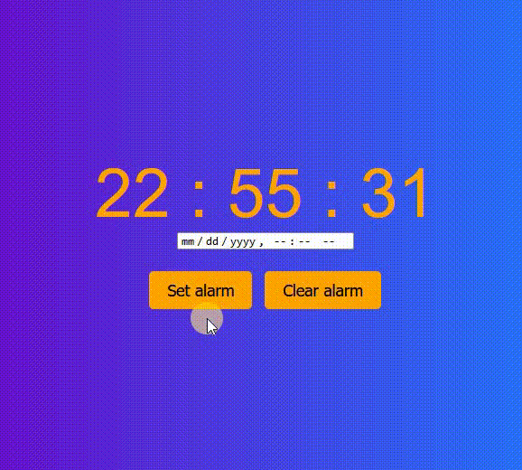

# 🛠 JS - alarm clock

# 🔗 [Live Preview](https://magical-starship-daa3da.netlify.app/)

## Welcome! 👋

- In this learning project, I try to understand how JS functionality can be added to an alarm clock. First, it will load the current time, an alarm can be set 1 min into the future, and when the time is reached it will play audio on a loop until the "clear alarm" button is pressed.

### Languages and features 👨‍💻 

- JS: conditional statements, functions

Thanks for checking out my projects.